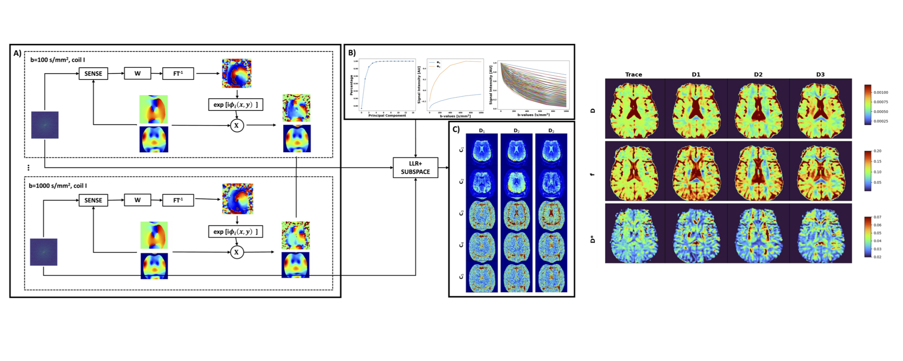

# High-Fidelity Intravoxel Parameter Estimation Using Locally Low Rank and Susbpace Modeling 

This is the code repository correspondign to the paper igh-Fidelity Intravoxel Parameter 
Estimation Using Locally Low Rank and Susbpace Modeling. N.B. This method requires the raw k-space data 
and assumes a cartesian trajectory. 

Alternative k-space trajectories (e.g. spiral) will require 
appropriate code updates

The numerical brain phantom needs to be downloaded from BrainWeb: 
[https://brainweb.bic.mni.mcgill.ca/](https://brainweb.bic.mni.mcgill.ca/) 

## Required Software 

- Python (v3.9)
- Berkeley Advanced Reconstruction Toolbox (BART, v1.09)
- MATLAB 2021a (MathWorks Inc., Natick, MA, USA)

## Code Use

- Run `dictionary_gen.py` to simulate an IVIM dictionary and a corresponding basis set using SVD.
- `Phantom_IVIM.py` can be run for the numerical brain phantom. 
- Run `IVIM_LLR.py` to reconstruct raw kspace data. 

## Contact Information 

Please contact `alan_finkelstein@urmc.rochester.edu` for any questions.

### Cite As:
Finkelstein, A. J., Liao, C., Cao, X., Mani, M., Schifitto, G., & Zhong, J. (2024). High-Fidelity Intravoxel Incoherent Motion Parameter Mapping Using Locally Low-Rank and Subspace Modeling. NeuroImage, 120601

https://www.sciencedirect.com/science/article/pii/S105381192400096X?via%3Dihub 

